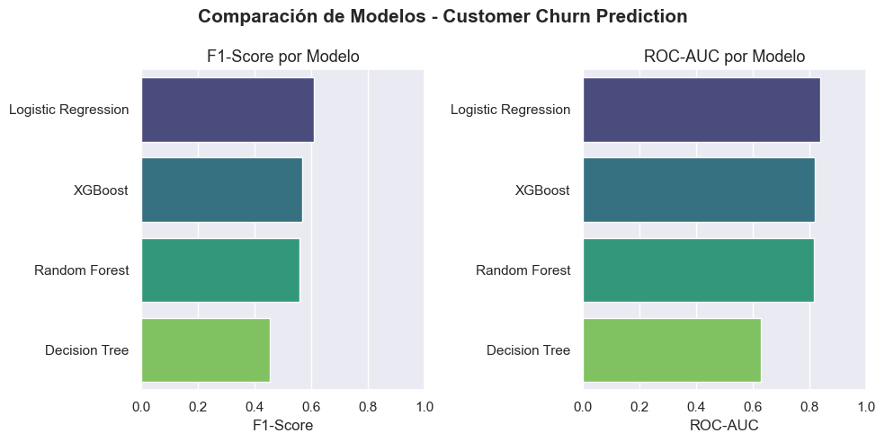
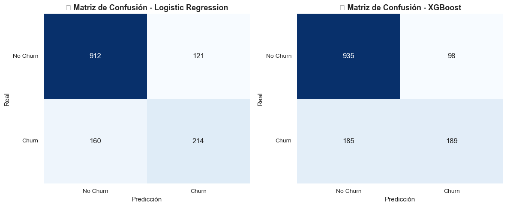
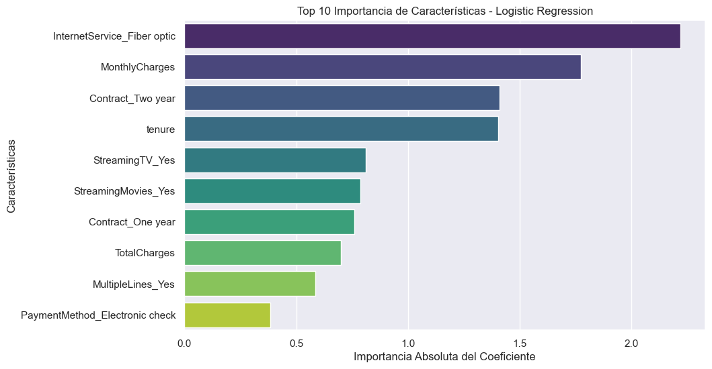

# 📉 Customer Churn Prediction

**Telco churn classification where the simple model won — Logistic Regression beats a tuned XGBoost where it matters: fewer missed churners.**


---

## Overview

End-to-end churn prediction on the **Telco Customer Churn** dataset (~7K customers, ~27% churn). In telecom, retaining a customer costs far less than acquiring one, so the objective is operational, not academic: **minimise false negatives** — the churners the model fails to flag — even at the price of some extra false positives.

Four classifiers are benchmarked (Logistic Regression, Decision Tree, Random Forest, XGBoost), with `GridSearchCV` + stratified cross-validation on the two finalists. The honest result: **the simplest model wins**.

## Results



Head-to-head on the held-out test set (churn = positive class):

| Metric (Churn) | Logistic Regression | XGBoost (tuned) |
|---|---:|---:|
| **Recall** | **0.572** | 0.505 |
| **F1-score** | **0.604** | 0.572 |
| Precision | 0.639 | 0.659 |
| Accuracy | 0.800 | 0.799 |
| **False negatives** | **160** | 185 |



Logistic Regression misses **25 fewer churners** than the tuned XGBoost at near-identical accuracy. Given the business asymmetry (a missed churner is a lost customer; a false alarm is just an unnecessary discount), it is the recommended model.

**What drives churn?** Fiber-optic internet service, high monthly charges and short tenure dominate; two-year contracts are the strongest retention signal:



## How to run

```bash
git clone https://github.com/nicotimoneda/Customer-Churn-Prediction.git
cd Customer-Churn-Prediction
pip install -r requirements.txt
jupyter notebook   # run notebooks 01 → 02 → 03
```

## Project structure

```text
Customer-Churn-Prediction/
├── data/
│   ├── raw/                      # Telco_Customer_Churn.csv
│   └── processed/                # stratified train/test splits
├── notebooks/
│   ├── 01_EDA.ipynb              # target balance, distributions, churn patterns
│   ├── 02_Preprocessing.ipynb    # encoding, scaling, stratified split
│   └── 03_Model_Training.ipynb   # 4-model benchmark + GridSearchCV + threshold analysis
├── src/
│   └── data_preprocessing.py     # reusable preprocessing functions
├── assets/                       # figures exported from the notebooks
└── requirements.txt
```

## Methodology

1. **EDA** — class balance, numeric distributions by churn status, categorical churn patterns (contract type, payment method, internet service).
2. **Preprocessing** — one-hot encoding, scaling, stratified train/test split.
3. **Benchmark** — Logistic Regression, Decision Tree, Random Forest and XGBoost compared on F1 and ROC-AUC.
4. **Tuning** — `GridSearchCV` with stratified CV on the two best models; decision-threshold analysis to trade precision against recall.
5. **Selection** — Logistic Regression chosen on recall/F1 and interpretability; coefficient analysis doubles as the feature-importance story for stakeholders.

## Contact

Nicolás Timoneda · [nicotimoneda@gmail.com](mailto:nicotimoneda@gmail.com) · [@nicotimoneda](https://github.com/nicotimoneda)

## License

MIT — see [`LICENSE`](LICENSE).
